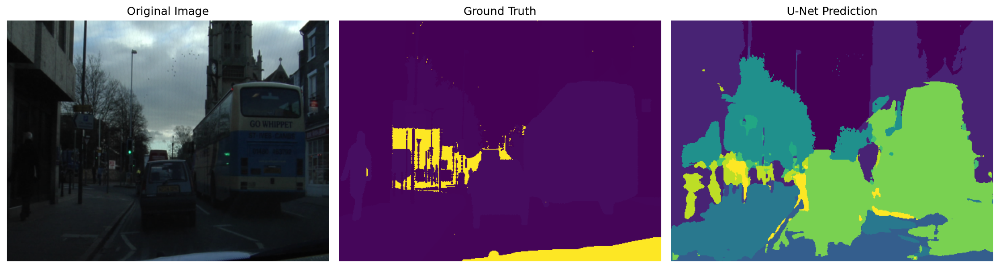
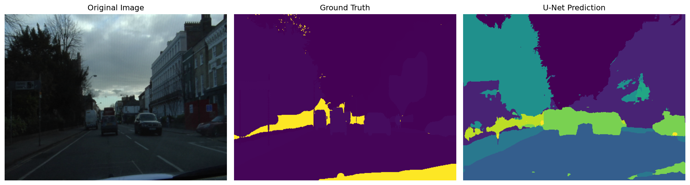
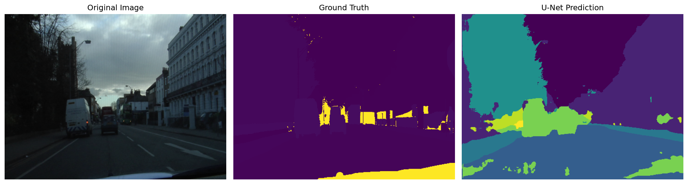

# CamVid Semantic Segmentation with U-Net

A PyTorch-based semantic segmentation project for road-scene understanding using the CamVid dataset and a U-Net architecture.

The model performs pixel-level classification across 11 semantic classes, including road, sky, building, car, pedestrian, and bicyclist.

---

## Project Overview

Semantic segmentation assigns a semantic class to every pixel in an image.

In this project, a U-Net model is trained on the CamVid road-scene dataset to classify each pixel into one of 11 grouped semantic classes.

The project implements an end-to-end semantic segmentation pipeline:

- Dataset preparation and train/validation/test splitting
- RGB mask to class-ID conversion
- PyTorch Dataset and DataLoader
- U-Net model implementation
- Training on Apple Silicon using MPS
- Validation using Mean IoU
- Final evaluation on a held-out test set
- Per-class IoU analysis
- Prediction visualization
- Training-curve visualization

---

## Dataset

This project uses the **CamVid road-scene dataset**.

The original CamVid labels are mapped into 11 grouped semantic classes:

| ID | Class |
|---:|---|
| 0 | Sky |
| 1 | Building |
| 2 | Pole |
| 3 | Road |
| 4 | Pavement |
| 5 | Tree |
| 6 | SignSymbol |
| 7 | Fence |
| 8 | Car |
| 9 | Pedestrian |
| 10 | Bicyclist |

Pixels that do not correspond to a training class are assigned an ignore index of `255` and are excluded from the loss and metric calculations.

### Dataset Split

The dataset contains 701 image-mask pairs:

| Split | Images |
|---|---:|
| Training | 490 |
| Validation | 105 |
| Test | 106 |
| **Total** | **701** |

---

## Preprocessing

Input images and segmentation masks are resized to:

```text
Height: 360
Width: 480
Images

Images are:

Converted to RGB
Resized using bilinear interpolation
Converted to PyTorch tensors
Transposed to (C, H, W)
Normalized from [0, 255] to [0, 1]
Segmentation Masks

Masks are:

Converted to RGB
Resized using nearest-neighbor interpolation
Converted from RGB colors to integer class IDs
Assigned 255 for ignored/unknown pixels

Nearest-neighbor interpolation is used for masks to prevent interpolation from creating invalid class colors.

Model

The project uses a U-Net architecture for semantic segmentation.

Input
3 × 360 × 480
Output
11 × 360 × 480

The 11 output channels correspond to the 11 semantic classes.

For each pixel, the predicted class is obtained by selecting the class with the highest output score.

Training

The model was trained for 20 epochs using PyTorch on an Apple Silicon GPU through the Metal Performance Shaders (MPS) backend.

Training Configuration
Parameter	Value
Framework	PyTorch
Device	Apple MPS
Epochs	20
Batch size	4
Input resolution	360 × 480
Number of classes	11
Training samples	490
Validation samples	105

The best checkpoint was selected according to validation Mean IoU.

Best Validation Result
Best Validation Mean IoU: 0.5274

The trained checkpoint is generated locally at:

checkpoints/best_model.pth

The dataset and model checkpoint are excluded from the Git repository using .gitignore.

Results

The final model was evaluated on the held-out test set containing 106 images.

Metric	Score
Pixel Accuracy	90.35%
Mean IoU	57.18%
Dice Score	68.24%
Metric Summary

Pixel Accuracy measures the percentage of correctly classified pixels.

Mean IoU (Intersection over Union) measures the average overlap between predicted and ground-truth regions across the semantic classes.

Dice Score measures the overlap between predicted and ground-truth segmentation regions.

Per-Class Performance

The final test evaluation produced the following IoU scores:

Class	IoU
Sky	92.20%
Building	82.09%
Pole	14.55%
Road	94.29%
Pavement	78.50%
Tree	74.96%
SignSymbol	32.10%
Fence	39.74%
Car	68.56%
Pedestrian	19.17%
Bicyclist	32.83%

The model performs particularly well on large and visually distinctive regions such as:

Road
Sky
Building
Pavement
Tree

Smaller objects are more challenging, particularly:

Pole
Pedestrian
Bicyclist
SignSymbol
Fence

The strongest class is Road, with an IoU of 94.29%.

Visual Results

The project includes qualitative segmentation results generated from the test set.

The generated predictions are stored in:

outputs/visualizations/

Example predictions:

<p align="center">  </p> <p align="center">  </p> <p align="center">  </p>
Training Curves

Training and validation curves are generated from the 20-epoch training run.

Training Loss
<p align="center">  </p>
Validation Mean IoU
<p align="center">  </p>

These plots provide a visual overview of model optimization and validation performance throughout training.

Project Structure
road-segmentation/
│
├── notebooks/
│   └── 01_explore_camvid.ipynb
│
├── outputs/
│   ├── class_visualizations/
│   ├── visualizations/
│   ├── training_loss.png
│   └── validation_miou.png
│
├── src/
│   ├── __init__.py
│   ├── camvid_classes.py
│   ├── camvid_dataset.py
│   ├── metrics.py
│   ├── plot_training.py
│   ├── split_dataset.py
│   ├── test.py
│   ├── test_classes.py
│   ├── test_dataloader.py
│   ├── test_dataset.py
│   ├── test_metrics.py
│   ├── test_model.py
│   ├── test_per_class.py
│   ├── train.py
│   ├── unet.py
│   ├── visualize.py
│   └── visualize_classes.py
│
├── .gitignore
├── README.md
└── requirements.txt

The dataset and trained checkpoint are intentionally not included in the repository.

Installation
1. Clone the repository
git clone https://github.com/sarakhodabandeh/road-segmentation.git
cd road-segmentation
2. Create a virtual environment
python3.11 -m venv .venv
3. Activate the environment
source .venv/bin/activate
4. Install dependencies
pip install -r requirements.txt
Running the Project
Test the dataset
python -m src.test_dataset
Test the DataLoader
python -m src.test_dataloader
Test the U-Net model
python -m src.test_model
Train the model
python -m src.train
Evaluate the model
python -m src.test_metrics
Evaluate individual classes
python -m src.test_per_class
Generate segmentation visualizations
python -m src.visualize
Generate training curves
python -m src.plot_training
Future Improvements

Several improvements could potentially increase performance, especially for smaller and less frequent classes:

Data augmentation
Class-weighted loss
Combined Cross-Entropy and Dice loss
Learning-rate scheduling
Transfer learning with a pretrained encoder
Higher-resolution training
Improved handling of small objects
More extensive hyperparameter tuning
Additional qualitative error analysis
Technologies
Python 3.11
PyTorch
NumPy
Pillow
Matplotlib
Apple Metal Performance Shaders (MPS)
Author

Sara Khodabandeh

Computer Vision & Deep Learning Project

License

This project is intended for educational and portfolio purposes.