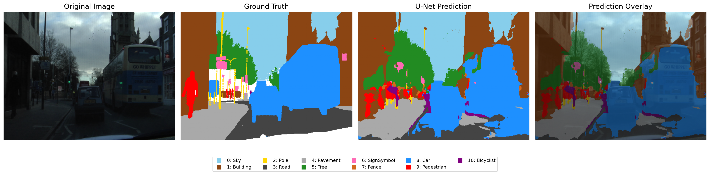
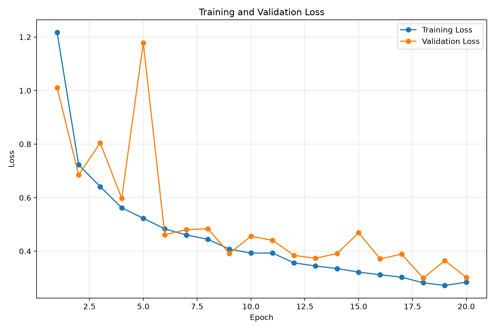
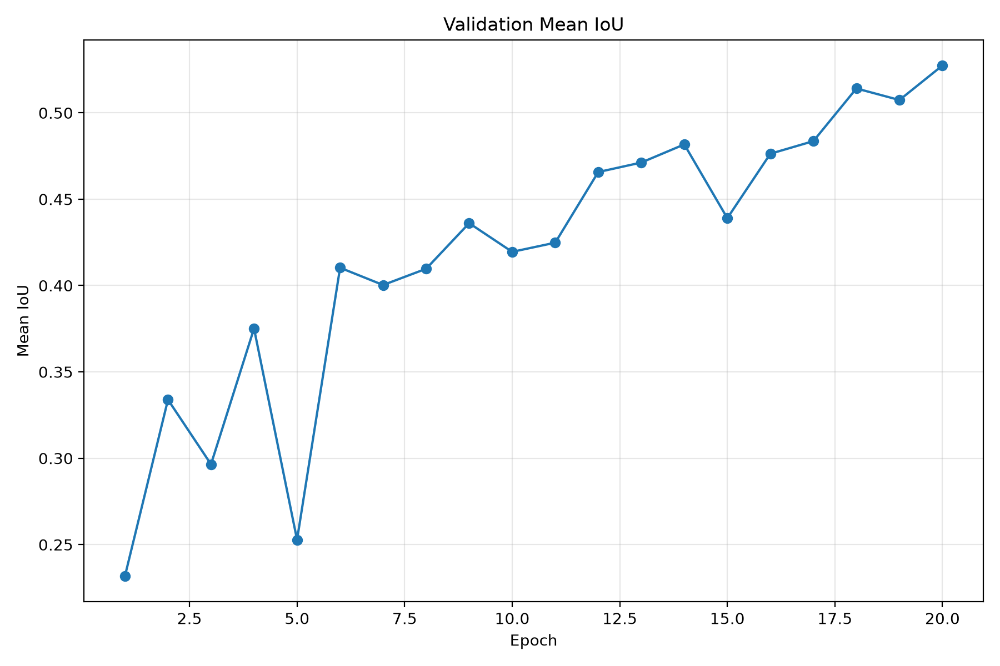

CamVid Semantic Segmentation with U-Net

A PyTorch-based semantic segmentation project for road-scene understanding using the CamVid dataset and a custom U-Net architecture.

The model performs pixel-level classification across 11 semantic classes, including road, sky, building, car, pedestrian, and bicyclist.

Key Results

The final model was evaluated on a held-out test set of 106 images.

Metric	Result
Best Validation mIoU	52.74%
Test Pixel Accuracy	90.35%
Test Mean IoU	57.18%
Test Dice Score	68.24%
Test Images	106

The model achieved its best validation Mean IoU of 52.74% at epoch 20.

Project Overview

Semantic segmentation assigns a semantic class to every pixel in an image.

In this project, a U-Net model is trained to perform semantic segmentation on road-scene images from the CamVid dataset.

The project implements an end-to-end segmentation pipeline including:

CamVid dataset preparation
RGB mask to class-ID conversion
Train/validation/test splitting
PyTorch Dataset and DataLoader implementation
Custom U-Net architecture
Training with Apple Silicon MPS acceleration
Validation during training
Pixel Accuracy, Mean IoU, and Dice evaluation
Per-class IoU analysis
Qualitative prediction visualization
Training curve visualization
Dataset

This project uses the CamVid road-scene semantic segmentation dataset.

The original CamVid labels are grouped into 11 semantic classes:

ID	Class
0	Sky
1	Building
2	Pole
3	Road
4	Pavement
5	Tree
6	SignSymbol
7	Fence
8	Car
9	Pedestrian
10	Bicyclist

Void and unknown pixels are assigned an ignore index of 255 and are excluded from the loss and metric calculations.

Dataset Split
Split	Images
Training	490
Validation	105
Test	106
Total	701
Preprocessing

All images and segmentation masks are resized to:

Height: 360
Width: 480
Images

Input images are:

Converted to RGB
Resized using bilinear interpolation
Converted to PyTorch tensors
Normalized from [0, 255] to [0, 1]
Segmentation Masks

Segmentation masks are:

Converted to RGB
Resized using nearest-neighbor interpolation
Converted from RGB colors to integer class IDs
Assigned 255 to ignored/void pixels

Nearest-neighbor interpolation is used for masks to prevent interpolation from creating invalid class colors.

U-Net Architecture

The project uses a custom implementation of the U-Net encoder-decoder architecture.

U-Net is well suited for semantic segmentation because it combines:

Hierarchical feature extraction through the encoder
Spatial reconstruction through the decoder
Skip connections between corresponding encoder and decoder stages

The model receives an RGB image and produces a per-pixel prediction for all 11 semantic classes.

Model Input
3 × 360 × 480
Model Output
11 × 360 × 480

Each output channel corresponds to one semantic class.

The predicted class for each pixel is obtained by taking the argmax across the class dimension.

Training

The model was trained for 20 epochs using the Apple Silicon Metal Performance Shaders (MPS) backend.

Training Configuration
Parameter	Value
Framework	PyTorch
Architecture	U-Net
Device	Apple Silicon MPS
Epochs	20
Batch Size	4
Input Resolution	360 × 480
Number of Classes	11
Training Samples	490
Validation Samples	105

The best model checkpoint was selected based on the highest validation Mean IoU.

Best Validation mIoU: 0.5274

The checkpoint is saved locally as:

checkpoints/best_model.pth
Evaluation

The final checkpoint was evaluated on the held-out test set containing 106 images.

Overall Test Results
Metric	Score
Pixel Accuracy	90.35%
Mean IoU	57.18%
Dice Score	68.24%
Metric Definitions

Pixel Accuracy measures the percentage of valid pixels that are classified correctly.

Mean Intersection over Union (mIoU) calculates IoU independently for each class and then averages the class-level IoUs.

Dice Score measures the overlap between the predicted segmentation and the ground-truth segmentation.

Per-Class Performance

The final model was also evaluated separately for each semantic class.

Class	IoU
Sky	92.20%
Building	82.09%
Pole	14.55%
Road	94.29%
Pavement	78.50%
Tree	74.96%
SignSymbol	32.10%
Fence	39.74%
Car	68.56%
Pedestrian	19.17%
Bicyclist	32.83%

The model performs particularly well on large and visually distinctive regions.

The strongest classes are:

Road — 94.29% IoU
Sky — 92.20% IoU
Building — 82.09% IoU
Pavement — 78.50% IoU
Tree — 74.96% IoU

Smaller and less visually distinctive objects remain more challenging, particularly:

Pole — 14.55% IoU
Pedestrian — 19.17% IoU
SignSymbol — 32.10% IoU
Bicyclist — 32.83% IoU

This highlights the difficulty of accurately segmenting small objects in road scenes.

Qualitative Results

The project generates visual comparisons between the original image, ground-truth segmentation, U-Net prediction, and prediction overlay.

Example Segmentation Result

  

Additional visualization examples are available in:

outputs/class_visualizations/
outputs/visualizations/
Training Curves

Training and validation metrics are saved during the experiment.

Training Loss

  

Validation Mean IoU

  

These plots show the model's learning progress over the 20 training epochs.

Project Structure
road-segmentation/
│
├── notebooks/
│   └── 01_explore_camvid.ipynb
│
├── outputs/
│   ├── class_visualizations/
│   │   ├── sample_1.png
│   │   ├── sample_2.png
│   │   ├── sample_3.png
│   │   ├── sample_4.png
│   │   └── sample_5.png
│   │
│   ├── visualizations/
│   │   ├── sample_1.png
│   │   ├── sample_2.png
│   │   ├── sample_3.png
│   │   ├── sample_4.png
│   │   └── sample_5.png
│   │
│   ├── training_loss.png
│   └── validation_miou.png
│
├── src/
│   ├── __init__.py
│   ├── camvid_classes.py
│   ├── camvid_dataset.py
│   ├── metrics.py
│   ├── plot_training.py
│   ├── split_dataset.py
│   ├── train.py
│   ├── unet.py
│   ├── visualize.py
│   ├── visualize_classes.py
│   │
│   ├── test.py
│   ├── test_classes.py
│   ├── test_dataloader.py
│   ├── test_dataset.py
│   ├── test_metrics.py
│   ├── test_model.py
│   └── test_per_class.py
│
├── .gitignore
├── README.md
└── requirements.txt

The raw and processed CamVid dataset files and trained model checkpoint are excluded from version control.

Installation
1. Clone the repository
git clone https://github.com/sarakhodabandeh/road-segmentation.git
cd road-segmentation
2. Create a virtual environment

Python 3.11 was used for development.

python3.11 -m venv .venv
3. Activate the environment

macOS/Linux:

source .venv/bin/activate
4. Install dependencies
pip install -r requirements.txt
Dataset Setup

Download the CamVid dataset and place the required images and segmentation masks inside the project's data directory.

The expected processed structure is:

data/
└── processed/
    ├── train/
    │   ├── images/
    │   └── masks/
    │
    ├── val/
    │   ├── images/
    │   └── masks/
    │
    └── test/
        ├── images/
        └── masks/

The dataset itself is not included in this repository.

Running the Project
Test the dataset
python -m src.test_dataset
Test the DataLoader
python -m src.test_dataloader
Test the U-Net model
python -m src.test_model
Train the model
python -m src.train
Evaluate the model
python -m src.test_metrics
Calculate per-class IoU
python -m src.test_per_class
Generate segmentation visualizations
python -m src.visualize
Generate training curves
python -m src.plot_training
Hardware

Training was performed on an Apple Silicon Mac using the PyTorch MPS backend.

The project automatically uses MPS when available and falls back to CPU otherwise.

if torch.backends.mps.is_available():
    device = torch.device("mps")
else:
    device = torch.device("cpu")
Technologies
Python 3.11
PyTorch
NumPy
Pillow
Matplotlib
Apple Metal Performance Shaders (MPS)
Git / GitHub
Future Improvements

Several improvements could potentially increase segmentation performance, particularly for small objects:

Data augmentation
Class-weighted loss
Dice loss or combined Cross-Entropy + Dice loss
Learning-rate scheduling
Transfer learning with a pretrained encoder
A deeper or more efficient segmentation architecture
Higher-resolution training
Improved handling of class imbalance
Additional qualitative analysis
Experimenting with modern segmentation architectures
Project Highlights

This project demonstrates an end-to-end computer vision workflow:

CamVid Dataset
      ↓
Dataset Preparation
      ↓
RGB Mask → Class IDs
      ↓
Train / Validation / Test Split
      ↓
PyTorch Dataset & DataLoader
      ↓
Custom U-Net
      ↓
Training on Apple MPS
      ↓
Validation
      ↓
Best Model Selection
      ↓
Test Evaluation
      ↓
Per-Class Analysis
      ↓
Segmentation Visualization

The project was developed as a practical computer vision and deep learning project focused on semantic segmentation.

Author

Sara Khodabandeh Yalabadi

Computer Science graduate | Aspiring AI graduate student

Focused on computer vision, deep learning, and semantic segmentation.